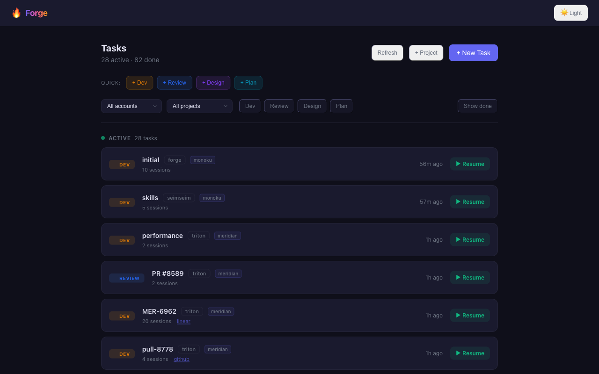
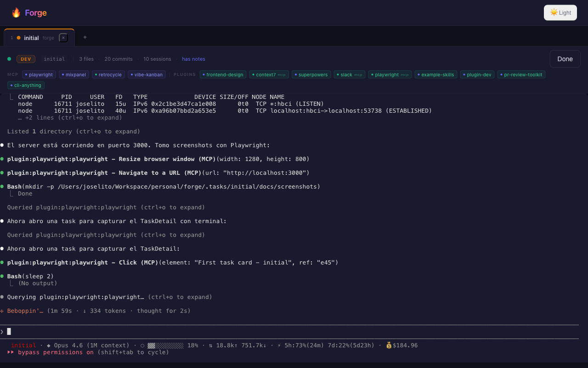
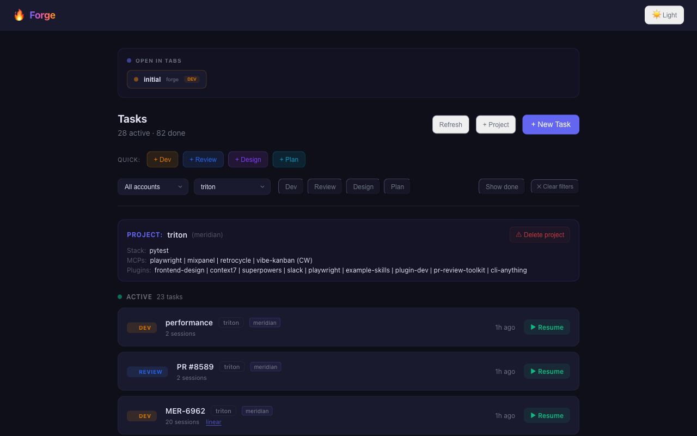

<div align="center">

<br />

```
                                                                        
    ███████╗ ██████╗ ██████╗  ██████╗ ███████╗
    ██╔════╝██╔═══██╗██╔══██╗██╔════╝ ██╔════╝
    █████╗  ██║   ██║██████╔╝██║  ███╗█████╗  
    ██╔══╝  ██║   ██║██╔══██╗██║   ██║██╔══╝  
    ██║     ╚██████╔╝██║  ██║╚██████╔╝███████╗
    ╚═╝      ╚═════╝ ╚═╝  ╚═╝ ╚═════╝ ╚══════╝
                                                
```

**Where ideas are shaped into software.**

[](LICENSE)
[](https://nodejs.org)
[](https://typescriptlang.org)
[](CONTRIBUTING.md)

<br />

**Forge** is a visual dashboard for [CW (Claude Workspace Manager)](https://github.com/avarajar/cw) — manage worktree sessions, tasks, PR reviews, and Claude Code integrations from a single web UI.

[Getting Started](#-getting-started) &bull; [Screenshots](#-screenshots) &bull; [Architecture](#-architecture) &bull; [Modules](#-modules) &bull; [Roadmap](#-roadmap)

<br />

---

</div>

<br />

## What It Does

Forge is the **visual frontend for CW**. Instead of running `cw work`, `cw review`, `cw spaces` in the terminal, you get a web dashboard with:

- **Task list** with filters by account, project, and type (dev/review/design/plan)
- **Multi-tab terminal sessions** — open multiple Claude Code sessions side by side
- **Project info** — auto-detected stack, MCPs, plugins at a glance
- **One-click actions** — start tasks, review PRs, mark done, create projects
- **Keyboard shortcuts** — Cmd+1..5, Cmd+W, Cmd+L for tab navigation

It reads from `~/.cw/` (sessions, projects, accounts) and from `~/.claude/` (MCPs, plugins, settings).

<br />

## Screenshots

### Task List
Filter tasks by account, project, type. Quick-launch buttons for new work.



### Task Detail
Interactive terminal with Claude Code, git stats, MCP/plugin info, and session metadata.



### Project View
Filter by project to see detected stack, MCPs, and plugins. Manage or delete projects.



<br />

## Getting Started

### Prerequisites

| Requirement | Version | Install |
|-------------|---------|---------|
| **Node.js** | >= 20 | [nodejs.org](https://nodejs.org) |
| **Python 3** | >= 3.9 | Required by CW for session management |
| **Git** | any recent | Worktree support required |
| **Claude Code** | latest | `npm i -g @anthropic-ai/claude-code` |
| **[CW](https://github.com/avarajar/cw)** | latest | `git clone https://github.com/avarajar/cw.git && cd cw && ./install.sh` |

### CW Setup

CW must be initialized before Forge can read your workspace:

```bash
cw init                          # Initialize ~/.cw/
cw account add <name>            # Add a Claude Code account
cw open <project>                # Register a project (or cw project register)
```

Once you have at least one project registered, Forge will show it in the dashboard.

### Launch

The easiest way — if you have CW installed:

```bash
cw forge
```

Or run directly with npx (no install needed):

```bash
npx @forge-dev/platform
```

Or install globally:

```bash
npm i -g @forge-dev/platform
forge console
```

The dashboard opens at `http://localhost:3000`.

### Development

To work on Forge itself:

```bash
git clone https://github.com/avarajar/forge.git
cd forge
npm install
npx turbo dev
```

<br />

## Architecture

```
┌─────────────────────────────────────────────────────┐
│              FORGE CONSOLE (Preact + UnoCSS)         │
│         ~100KB gzipped · dark/light themes           │
└───────────────────────┬──────────────────────────────┘
                        │ HTTP + WebSocket
┌───────────────────────┼──────────────────────────────┐
│              FORGE SERVER (Hono)                       │
│                                                       │
│   CW Reader    PTY Manager    Module Loader           │
│   (sessions,   (node-pty,     (forge-module.json      │
│    projects,    xterm.js)      manifests)              │
│    MCPs)                                              │
│                                                       │
│   SQLite (local) ──── or ──── PostgreSQL (team)       │
└───────────────────────┬───────────────────────────────┘
                        │
          ┌─────────────┼─────────────┐
          │             │             │
     ~/.cw/        ~/.claude/     Claude Code
     sessions      settings       (spawned via
     projects      plugins        cw work/review)
     accounts      MCPs
```

### Tech Stack

| Layer | Tech |
|-------|------|
| Server | Hono (Node.js) |
| Dashboard | Preact + UnoCSS + Vite |
| Terminal | xterm.js + node-pty (WebSocket) |
| Database | better-sqlite3 (local) / PostgreSQL (team) |
| CLI | Commander.js |
| Build | Turborepo |
| Tests | Vitest (137 tests) |
| Language | TypeScript (strict) |

### Monorepo Structure

```
packages/
  core/       → Hono server, CW reader, PTY manager, DB
  console/    → Preact dashboard (app, pages, components, hooks)
  ui/         → Shared components (Terminal, StatusCard, ActionButton, Toast...)
  sdk/        → Module SDK (definePanel, types)
  cli/        → CLI commands (forge init/console/run)
  platform/   → Entry point (npx @forge-dev/platform)
modules/
  mod-dev/        — CW wrapper (worktrees, sessions)
  mod-scaffold/   — Project creation wizard
  mod-planning/   — Linear + Notion + diagrams
  mod-design/     — Figma + tokens + wireframes
  mod-qa/         — Tests, security, load, visual
  mod-release/    — Deploy, flags, rollback, changelog
  mod-monitor/    — Health, errors, uptime, costs
```

<br />

## Console Architecture

The dashboard is a Preact SPA with this component structure:

```
App
├── useTabManager (tab state, sessionStorage, keyboard shortcuts)
├── useTaskFilters (account/project/type filters, derived data)
│
├── List view
│   ├── OpenTabsBanner (shows tabs open in background)
│   ├── TaskList
│   │   ├── FilterBar (account, project, type pills)
│   │   ├── TaskCard / DoneTaskRow
│   │   └── ProjectBanner (stack, MCPs, plugins, delete)
│   ├── NewTask
│   └── CreateProjectModal
│
└── Tabs view
    ├── TabBar (tab bar + add menu)
    └── TaskDetail (terminal + git stats + MCP info)
```

Shared config lives in `config/types.ts` (type colors, labels, helpers).

<br />

## Modules

Forge supports extensible modules via `forge-module.json` manifests. Each module declares panels, actions, and detectors:

```json
{
  "name": "@forge-dev/mod-qa",
  "displayName": "QA",
  "icon": "test-tube",
  "actions": [
    { "id": "run-tests", "label": "Run Tests", "command": "npx vitest", "streaming": true }
  ],
  "detectors": [
    { "tool": "vitest", "files": ["vitest.config.*"], "suggestion": "Vitest detected" }
  ]
}
```

Panels are Preact components using `definePanel()` from `@forge-dev/sdk`.

<br />

## Development

```bash
npm install           # Install all workspace deps
npx turbo dev         # Dev mode (all packages)
npx turbo build       # Build all
npx turbo test        # Run all tests (137 tests)
```

### Run specific package

```bash
cd packages/core && npx vitest        # Core tests
cd packages/console && npx vite       # Dashboard dev server
```

<br />

## Roadmap

| Phase | Status | What |
|-------|--------|------|
| **0: Foundation** | Done | Core server, dashboard shell, module system, CLI, UI kit |
| **1: CW Integration** | Done | CW reader, sessions, PTY terminals, multi-tab |
| **2: Full Ecosystem** | Done | All 7 modules, team mode (PostgreSQL + auth) |
| **3: Polish** | In progress | UX improvements, error handling, performance |

<br />

## License

MIT &copy; [Jose Andrade](https://github.com/avarajar)
<div align="center">
<br />

---

<br />

**Built with Forge + [CW](https://github.com/avarajar/cw) + [Claude Code](https://claude.ai/code)**

<sub>Powered by [Hono](https://hono.dev), [Preact](https://preactjs.com), [xterm.js](https://xtermjs.org), and the open-source community.</sub>

</div>
