<div align="center">

<br />

```
                                                                        
    ███████╗ ██████╗ ██████╗  ██████╗ ███████╗
    ██╔════╝██╔═══██╗██╔══██╗██╔════╝ ██╔════╝
    █████╗  ██║   ██║██████╔╝██║  ███╗█████╗  
    ██╔══╝  ██║   ██║██╔══██╗██║   ██║██╔══╝  
    ██║     ╚██████╔╝██║  ██║╚██████╔╝███████╗
    ╚═╝      ╚═════╝ ╚═╝  ╚═╝ ╚═════╝ ╚══════╝
                                                
```

**Where ideas are shaped into software.**

[](LICENSE)
[](https://nodejs.org)
[](https://typescriptlang.org)
[](CONTRIBUTING.md)

<br />

**Forge** is a visual dashboard for [CW (Coding Workspace)](https://github.com/avarajar/cw) — manage worktree sessions, tasks, PR reviews, accounts and coding-agent harnesses from a single web UI.

[Getting Started](#-getting-started) &bull; [Screenshots](#-screenshots) &bull; [Architecture](#-architecture) &bull; [Modules](#-modules) &bull; [Roadmap](#-roadmap)

<br />

---

</div>

<br />

## What It Does

Forge is the **visual frontend for CW**. Instead of running `cw work`, `cw review`, `cw spaces` in the terminal, you get a web dashboard with:

- **Start from anything** — paste a pull request, a Linear or Notion link, or type a name; Forge picks review or dev and starts it
- **Task list** — most recently opened first, or grouped by project, with type, harness and done filters
- **Sidebar** — sections, projects grouped by account with a filter, and a card per live session with its context meter
- **Any harness** — run a task on Claude Code, Codex, Pi or OpenCode and see which one each session uses (needs CW 0.3.0)
- **Task detail** — the agent's terminal with context used, tokens and cost read from its status line, commits, unpushed work, MCPs, plugins and stack, plus GitHub and Open in editor
- **Multi-tab sessions** — keep several agents open; tabs stay connected while you browse the list
- **Command palette** — ⌘K or `/` to jump to a session, a task, a project or a command
- **Accounts** — one card per account with each harness's status and one-click Connect; Codex logs in with a device code, no terminal
- **Skills** — browse and edit global, account and project skills side by side, install from skills.sh, or start a session that writes one
- **Prototypes** — launches [Liveframe](https://liveframe.monokulabs.com): create or pull a frame, open an agent in it, push a version
- **Projects** — create, register, move and delete projects without leaving the dashboard
- **Dark and light themes** — system fonts, reduced-motion aware, and a layout that folds into an icon rail or an overlay on narrow windows

It reads from `~/.cw/` (sessions, projects, accounts, skills) and from `~/.claude/` (MCPs, plugins, settings).

<br />

## Screenshots

> Screenshots use demo data.

### Tasks
Paste a pull request, a ticket or a name into the start card: Forge detects the type and starts it on the right project and harness. Tasks are listed most recently opened first.

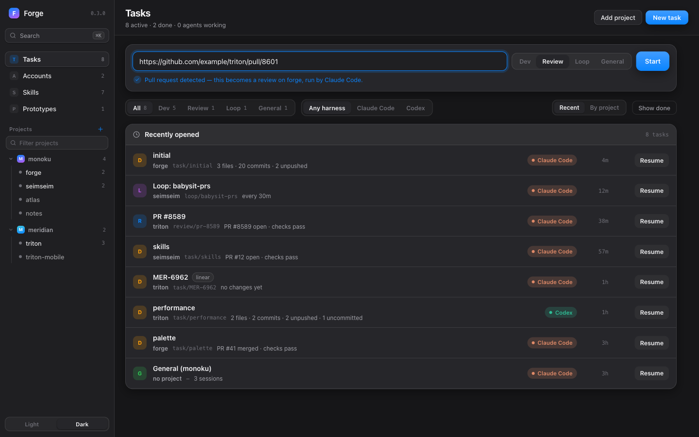

<table>
  <tr>
    <td width="50%">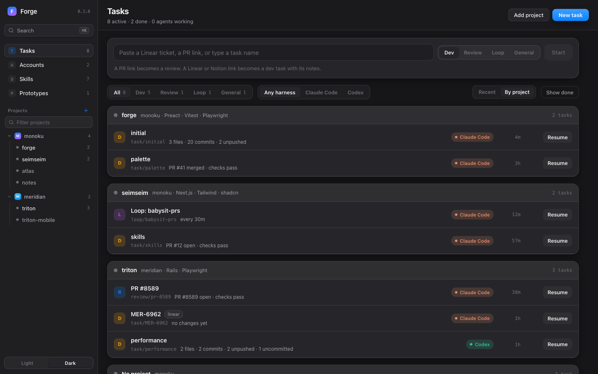<br /><sub><b>By project</b> — one card per project with its account and stack</sub></td>
    <td width="50%">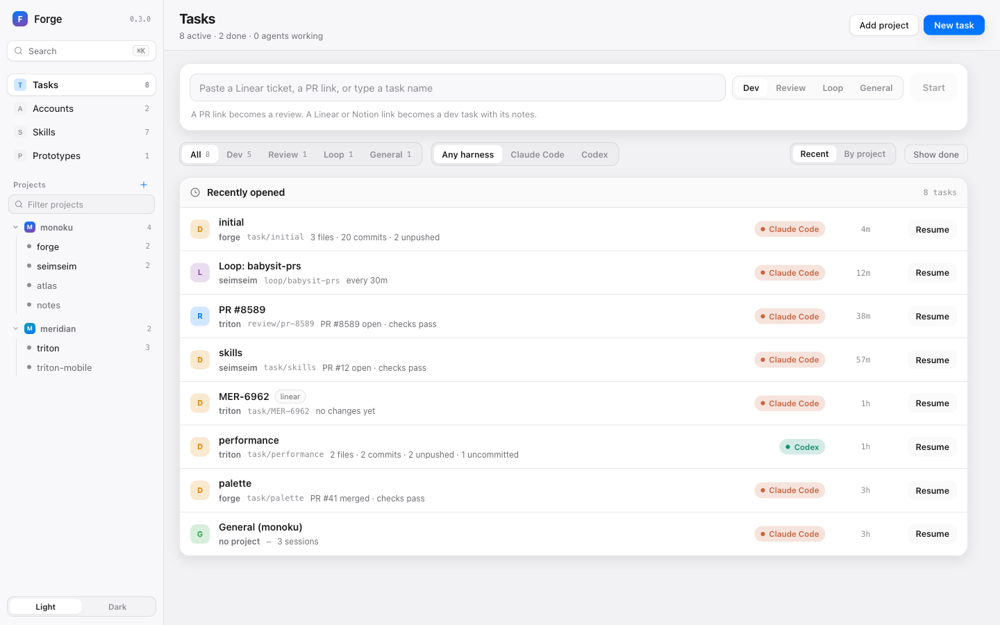<br /><sub><b>Light theme</b> — switch from the sidebar or with ⌘J</sub></td>
  </tr>
</table>

### Task Detail
The agent's terminal, framed, with the metrics its status line reports, the task's commits and unpushed work, the branch (click to copy), and the MCPs, plugins and stack behind it.

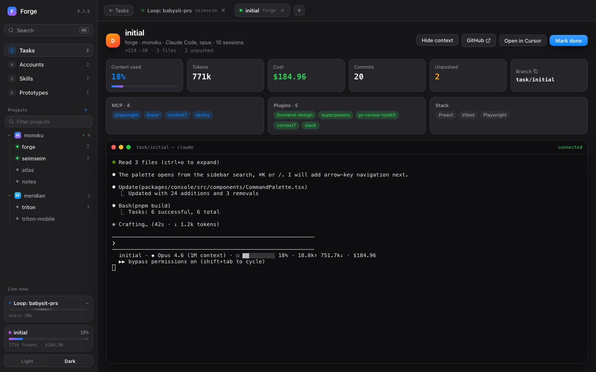

<table>
  <tr>
    <td width="50%">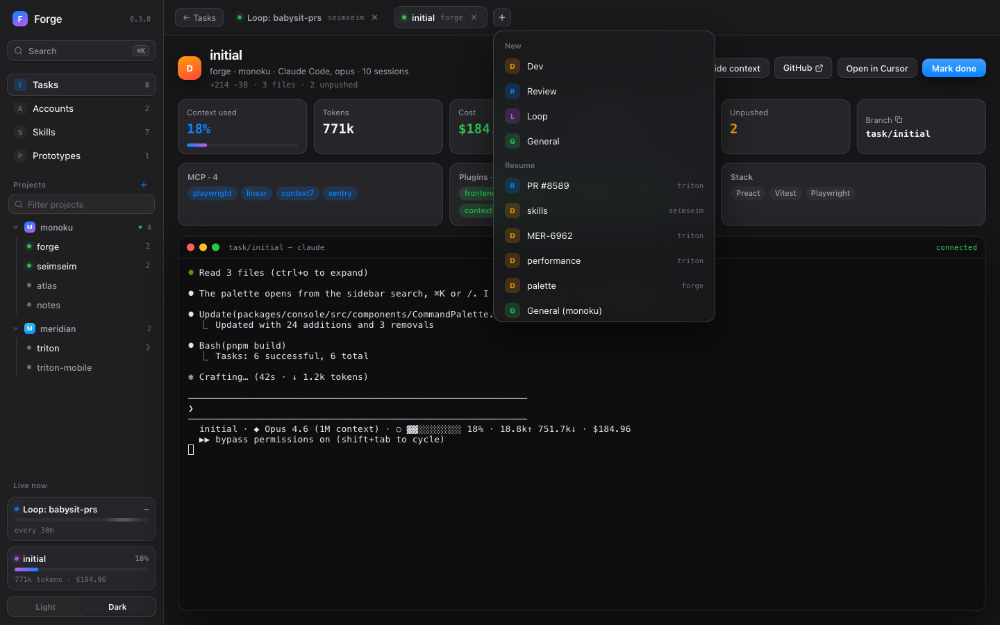<br /><sub><b>+ menu</b> — start a new task or resume one in another tab</sub></td>
    <td width="50%">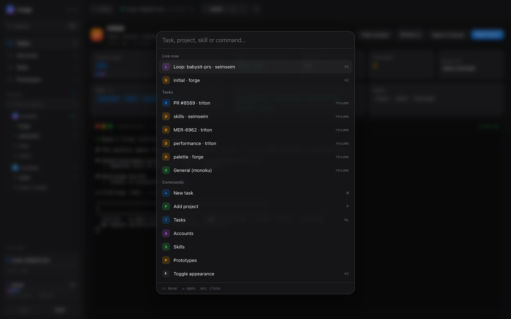<br /><sub><b>⌘K palette</b> — live sessions, tasks, projects and commands</sub></td>
  </tr>
</table>

### New Task
A drawer over the list. The type, harness, model and workflow are one click each, and the exact `cw` command is shown before you start.

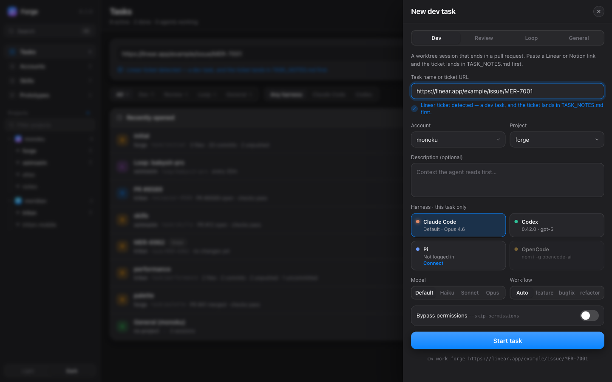

### Accounts
Each account with every harness: connected, API key, local model, or a Connect button.

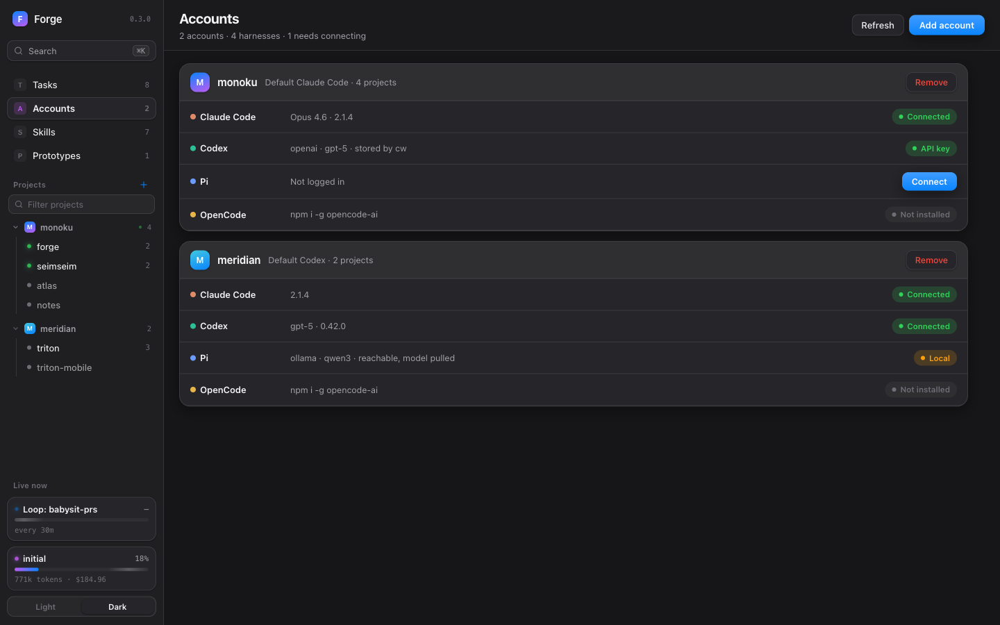

### Skills
The skill list and its editor side by side, with references as tabs and a search that falls through to skills.sh.

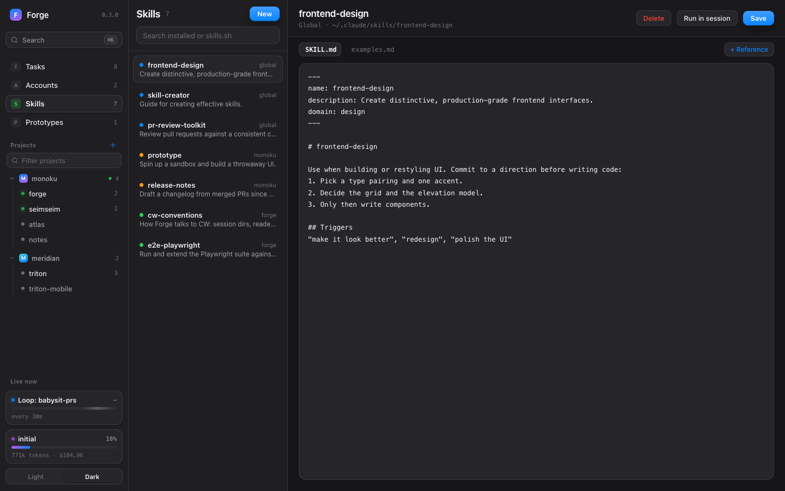

<table>
  <tr>
    <td width="50%">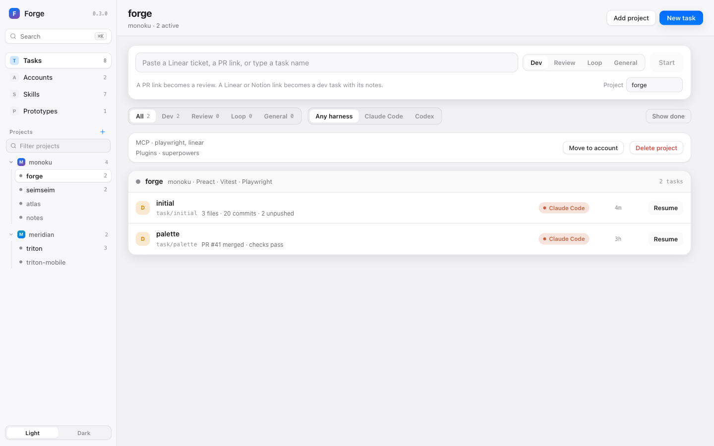<br /><sub><b>Project view</b> — pick a project in the sidebar to see its tasks, MCPs and actions</sub></td>
    <td width="50%">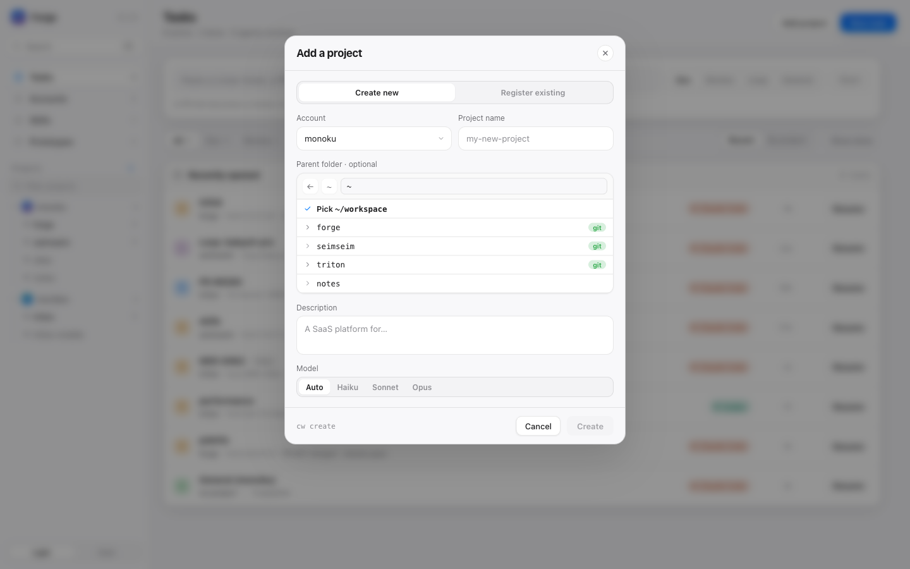<br /><sub><b>Add a project</b> — create one with <code>cw create</code> or register an existing repo</sub></td>
  </tr>
  <tr>
    <td width="50%">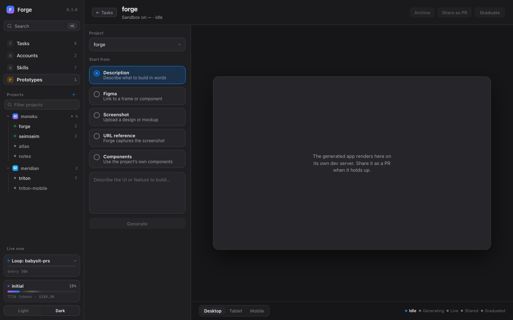<br /><sub><b>Prototypes</b> — Liveframe frames on this machine, each one an agent away</sub></td>
    <td width="50%" align="center">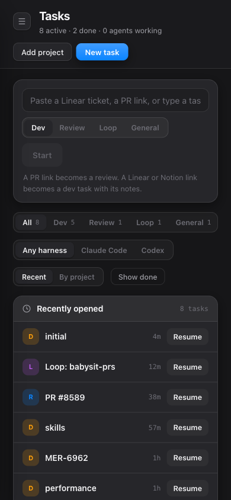<br /><sub><b>Narrow windows</b> — the sidebar becomes an overlay</sub></td>
  </tr>
</table>

<br />

## Getting Started

### Prerequisites

| Requirement | Version | Install |
|-------------|---------|---------|
| **Node.js** | >= 20 | [nodejs.org](https://nodejs.org) |
| **pnpm** | >= 11 | `corepack enable && corepack prepare pnpm@latest --activate` |
| **Python 3** | >= 3.9 | Required by CW for session management |
| **Git** | any recent | Worktree support required |
| **A harness** | latest | At least one of Claude Code (`npm i -g @anthropic-ai/claude-code`), Codex, Pi or OpenCode |
| **[CW](https://github.com/avarajar/cw)** | >= 0.3.0 | `git clone https://github.com/avarajar/cw.git && cd cw && ./install.sh` |

### CW Setup

CW must be initialized before Forge can read your workspace:

```bash
cw init                          # Initialize ~/.cw/
cw account add <name>            # Add an account (or use the Accounts screen in Forge)
cw open <project>                # Register a project (or cw project register)
```

Once you have at least one project registered, Forge will show it in the dashboard. You can also register an existing repo from Forge's Create Project dialog.

### Launch

Clone and run:

```bash
git clone https://github.com/avarajar/forge.git
cd forge
pnpm start
```

That's it — installs dependencies, builds, and opens the dashboard at `http://localhost:3000`. The first run takes ~1–2 minutes while it installs 249 packages and compiles the monorepo; subsequent starts are near-instant thanks to Turborepo's cache.

Other ways to launch:

```bash
cw forge                   # If you have CW installed
npx @forge-dev/platform    # No install needed
```

### Remote access

Forge listens on `127.0.0.1` and only answers requests from your own machine, because its API starts agents, logs accounts in, imports API keys and can delete project files. A page on another site can't call it, and neither can another computer on your network.

To reach it from another computer, set `FORGE_HOST` (for example `FORGE_HOST=0.0.0.0 pnpm start`). That also turns the same-machine check off and, outside team mode, there is no authentication, so only do it on a network you trust. From a remote browser, only Codex's device code can connect an account; the other harnesses' browser logins redirect to `localhost` on the machine running Forge.

### Development

To work on Forge itself:

```bash
pnpm install
pnpm dev
```

<br />

## Architecture

```
┌─────────────────────────────────────────────────────┐
│              FORGE CONSOLE (Preact + UnoCSS)         │
│    ~130KB gzipped with xterm.js · dark/light themes  │
└───────────────────────┬──────────────────────────────┘
                        │ HTTP + WebSocket
┌───────────────────────┼──────────────────────────────┐
│              FORGE SERVER (Hono)                       │
│                                                       │
│   Origin guard (same machine) · bearer auth (team)    │
│                                                       │
│   CW Reader    PTY Manager    Login Manager           │
│   (sessions,   (node-pty,     (device code,           │
│    projects,    xterm.js)      API key import)        │
│    MCPs)                                              │
│                                                       │
│   Skills       Liveframe      Module Loader           │
│   (skills.sh)  (lf CLI)       (forge-module.json)     │
│                                                       │
│   SQLite (local) ──── or ──── PostgreSQL (team)       │
└───────────────────────┬───────────────────────────────┘
                        │
          ┌─────────────┼─────────────┐
          │             │             │
     ~/.cw/        ~/.claude/     Harness: Claude Code,
     sessions      settings       Codex, Pi, OpenCode
     projects      plugins        (spawned via cw work,
     accounts      MCPs           review, launch)
```

### Tech Stack

| Layer | Tech |
|-------|------|
| Server | Hono (Node.js) |
| Dashboard | Preact + UnoCSS + Vite |
| Terminal | xterm.js + node-pty (WebSocket) |
| Database | better-sqlite3 (local) / PostgreSQL (team) |
| CLI | Commander.js |
| Build | Turborepo |
| Tests | Vitest (349 tests in `packages/core`) |
| Language | TypeScript (strict) |

### Monorepo Structure

```
packages/
  core/       → Hono server, CW reader, PTY manager, harness logins, skills, Liveframe, DB
  console/    → Preact dashboard (app, pages, components, hooks, design tokens)
  ui/         → Shared components (Terminal, StatusCard, ActionButton, Toast...)
  sdk/        → Module SDK (definePanel, types)
  cli/        → CLI commands (forge init/console/doctor/module/project/run)
  platform/   → Entry point (npx @forge-dev/platform)
modules/
  mod-hello/      — Minimal example manifest
  mod-dev/        — CW wrapper (worktrees, sessions)
  mod-scaffold/   — Project creation wizard
  mod-planning/   — Linear + Notion + diagrams
  mod-design/     — Figma + tokens + wireframes
  mod-qa/         — Tests, security, load, visual
  mod-release/    — Deploy, flags, rollback, changelog
  mod-monitor/    — Health, errors, uptime, costs
```

<br />

## Console Architecture

The dashboard is a Preact SPA with this component structure:

```
App → Shell (sidebar + main column, theme)
├── useTabManager (tab state, sessionStorage, ⌘1–5 / ⌘W / ⌘L)
├── useTaskFilters (project/type/harness filters, derived data)
├── useHarnesses (shared `cw doctor` store, 3 s polling)
├── useTerminalMetrics (context, tokens and cost from each tab's status line)
│
├── Sidebar → nav, projects by account (filter, fold), live session cards, appearance
├── Views
│   ├── TaskList → StartCard (type inference), filters, Recent / By project, ProjectBanner
│   ├── Accounts → account cards, device login, API key
│   ├── Skills → list + editor, create, skills.sh search
│   └── Prototypes → Liveframe frames: create, pull, push, open an agent
├── Tabs (kept mounted while the list is shown)
│   ├── TabBar → pill tabs, + menu
│   └── TaskDetail → identity, metric strip, context panel, terminal
├── NewTask drawer → HarnessPicker
├── CommandPalette (⌘K, /)
└── CreateProjectModal → DirectoryPicker
```

Design tokens (colors, shadows, motion) live in `styles/theme.css` for both themes; type colors and helpers live in `config/types.ts`.

### Keyboard

| Keys | Action |
|------|--------|
| `⌘K` or `/` | Command palette |
| `N` | New task |
| `P` | Add a project |
| `⌘J` | Switch light and dark |
| `⌘1`–`⌘5` | Go to a tab |
| `⌘←` `⌘→` | Previous or next tab |
| `⌘W` | Close the tab |
| `⌘L` | Back to the task list |

<br />

## Modules

> The server loads module manifests from `~/.forge/modules` (`forge module add`) and runs their actions through `/api/actions`. The dashboard does not render module panels today: they were dropped when the console became a CW task launcher.

Forge supports extensible modules via `forge-module.json` manifests. Each module declares panels, actions, and detectors:

```json
{
  "name": "@forge-dev/mod-qa",
  "displayName": "QA",
  "icon": "test-tube",
  "actions": [
    { "id": "run-tests", "label": "Run Tests", "command": "pnpm vitest", "streaming": true }
  ],
  "detectors": [
    { "tool": "vitest", "files": ["vitest.config.*"], "suggestion": "Vitest detected" }
  ]
}
```

Panels are Preact components using `definePanel()` from `@forge-dev/sdk`.

<br />

## Development

```bash
pnpm install          # Install all workspace deps
pnpm dev              # Dev mode (all packages)
pnpm build            # Build all
pnpm test             # Run all tests
```

`pnpm dev` runs the package watchers and the Vite dashboard on `http://localhost:5173`, but not the API server. Vite proxies `/api` and `/ws` to port 3000, so run `FORGE_NO_OPEN=1 node packages/platform/dist/index.js` in another terminal after `pnpm build`.

### Run specific package

```bash
cd packages/core && pnpm vitest        # Core tests (the only package with tests)
cd packages/console && pnpm vite       # Dashboard dev server
```

### Environment

| Variable | Default | Purpose |
|----------|---------|---------|
| `FORGE_PORT` | `3000` | Listen port |
| `FORGE_HOST` | `127.0.0.1` | Listen address; any other value turns off the same-machine check |
| `FORGE_DB_URL` | — | PostgreSQL URL for team mode |
| `FORGE_AUTH_TOKEN` | — | Bearer token for team mode |
| `FORGE_NO_OPEN` | — | `1` skips opening the browser |

<br />

## Roadmap

| Phase | Status | What |
|-------|--------|------|
| **0: Foundation** | Done | Core server, dashboard shell, module system, CLI, UI kit |
| **1: CW Integration** | Done | CW reader, sessions, PTY terminals, multi-tab |
| **2: Full Ecosystem** | Done | 7 module manifests, team mode (PostgreSQL + auth) |
| **3: Polish** | In progress | UX improvements, error handling, performance |
| **Harness integration** | Done | Claude Code, Codex, Pi and OpenCode sessions, Accounts screen, same-machine API |

<br />

## License

MIT &copy; [Jose Andrade](https://github.com/avarajar)
<div align="center">
<br />

---

<br />

**Built with Forge + [CW](https://github.com/avarajar/cw) + [Claude Code](https://claude.ai/code)**

<sub>Powered by [Hono](https://hono.dev), [Preact](https://preactjs.com), [xterm.js](https://xtermjs.org), and the open-source community.</sub>

</div>
